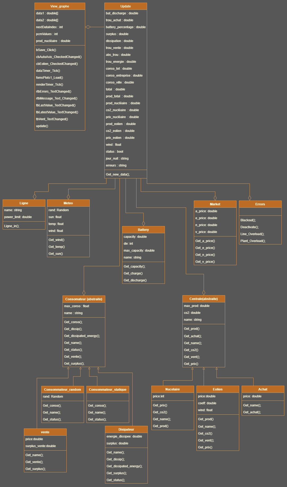
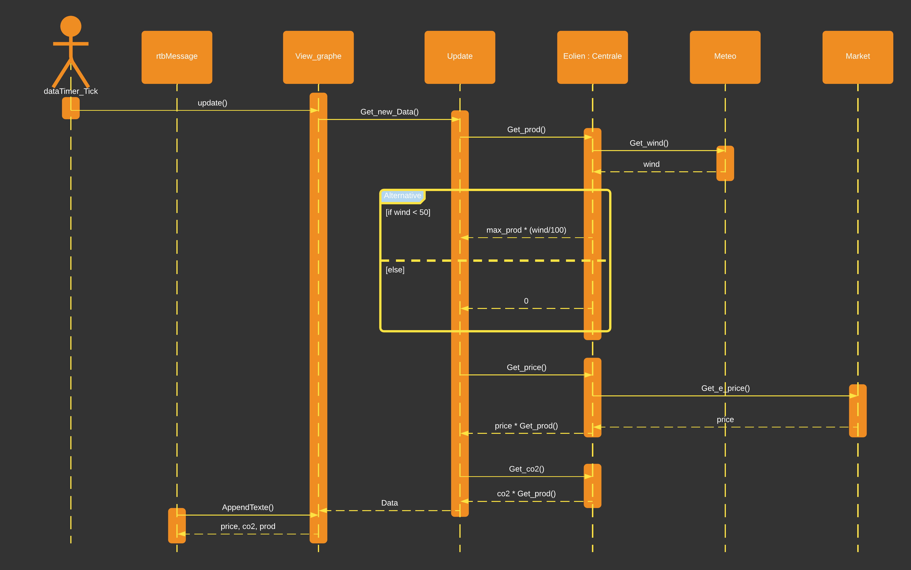

# Projet POO 20325 & 20194

Ce projet est une plateforme développée en C# destinée à des chercheurs désirant simuler un réseau électrique à diverses échelles.
Ce dernier possède une plateforme facile à modifier. 
Il est possible d’ajouter des sources productrices d’énergie, créer de nouveaux types de producteurs énergétiques, ajouter autant de consommateurs que l’on désire et de créer de nouveaux types de consommateurs.  
Un système de météo est présent qui permet de simuler 3 paramètres : la force du vent, l’ensoleillement ainsi que la température. 
Un système de marché permet de gérer les prix unitaires pour plusieurs types d’énergies ainsi que le prix auquel l’électricité est achetée depuis l’étrangers.

## Ajout d'un producteur d'énergie

Lors du développement de ce projet, nous avons décidé de créer trois types de producteurs d’énergie sans pour autant limiter ce nombre à l’avenir (nucléaire, éolien, achat à l’étrangers).
Pour créer une centrale d’un type connu, il faut commencer par ajouter du code dans la classe *Update* :
Il faut commencer par déclarer le nom de la centrale (x1) avant le constructeur *Update()* :
```csharp
Centrale x1;
```
Il faut également ajouter une variable pour stocker la valeur de production :
```csharp
double Xo1;
```
Ensuite, il faut créer une instance de la centrale au sein du constructeur *Update()* :
```csharp
x1 = new Eolien(2000, 1, "x1", market, bruxelles);
```
x1 est le nom utilisé dans le code lors d’appel de méthodes propres à cette instance, ou bien quand on doit récupérer ses attributs. Eolien est le type de centrale crée (il existe pour le moment Nucléaire, Eolien, et Achat) au sein des parenthèses, il faut mettre dans le bon ordre les paramètres de la centrale. On commence par la production maximale théorique exprimée en W, ensuite la quantité de CO2 produite par W. Market est le nom de la plateforme qui gère les prix de production et d’achat dans notre programme (objet de type *Market*) et dans le cas de l’éolien, nous avons également en paramètre la plateforme de météo (bruxelles) pour pourvoir récupérer la force du vent et ainsi produire de l’énergie en fonction de la valeur reçue.

À présent, nous pouvons assigner la centrale à une ligne électrique. Il suffit d’ajouter le bloc suivant dans la partie 

« ASIGNATION DES LIGNES & GESTION ERREURS SURCHARGES COTE PRODUCTION ».

Dans le cas de l’éolien nous pouvons choisir de désactiver sa production en pleine simulation avec cette condition que nous détaillerons plus tard.
```csharp
if (status_x1 == true){
```
Il faut commencer par placer dans la variable la valeur de production en appelant la méthode *Get_prod()* de l’objet x1 :
```csharp
double Xo1 = x1.Get_prod();
```
Nous assignons la ligne l1 avec la méthode *ligne_in()* et nous mettons en paramètres la production de la centrale :
```csharp
Xo1 = l1.Ligne_in(Xo1);
```
Il est également nécessaire d’ajouter cette production à la production totale se trouvant dans la variable prod_tot :
```csharp
prod_tot += Eo1;
```
Cette partie gère l’affichage de messages quand il y a une surcharge au niveau de la ligne véhiculant la production de x1 en précisant l’endroit et le moment ou la surcharge s’est passée :
```csharp
if (Xo1 == 0)
{
   erreurs += DateTime.Now.ToString();
   erreurs += errors.Line_Overload(l1);
   erreurs += "\n";
}
```
Par défaut, il existe déjà une centrale éolienne donc dans les ligne suivante nous devons incrémenter les valeurs de Co2 émis, du cout de production ainsi que la production de l’ensemble des centrales éoliennes:

```csharp
prix_eolien += x1.Get_prix();
co2_eolien += x1.Get_co2();
prod_eolien += Xo1;
```
Dans cette condition nous affichons un message lorsque la centrale est désactivée durant la simulation :
```csharp
else
{
    erreurs += DateTime.Now.ToString();
    erreurs += errors.Deactivate(x1);
    erreurs += "\n";
}
```
Si x1 est un type de centrale déjà existant, il n’y a plus de manipulations à faire.
Cependant, s’il s’agit d’un nouveau type de centrale, il faudra créer quelques variables en plus avant de passer dans la classe *view_graphe*.
Il faut créer une variables associées au coût de production, au CO2 ainsi qu’à la production avant le constructeur de la classe *Update* :
```csharp
public double prix_fusion;
public double co2_fusion;
public double prod_fusion;
```
si la centrale nécessite un mode marche/arrêt durant la simulation, il faut ajouter une variable booléenne dont nous changerons l’état dans la classe *view_graphe* :
```csharp
public bool status_x1 = true;
```
Il faut également ajouter la production de ce type de centrale dans la variable totale à la fin de la classe :
```csharp
total += prod_fusion;
```
À présent nous pouvons passer à la classe *view_graphe*.
Dans la partie AFFICHAGE, nous devons créer un nouveau type de centrale et y afficher ses infos. Nous utilisons un richTextBox rtbMessage pour faire cela :
```csharp
rtbMessage.AppendText("Fusion: "
    + up.prix_fusion.ToString() + " € "      //prix_x1
    + up.co2_fusion.ToString() + " g "       //co2_x1
    + up.prod_fusion.ToString() + " W "      //prod-x1
    + "\n");
```
Pour gérer l’état d’une centrale, il suffit de créer un checkbox qui sera nommé comme la centrale. Il faudra utiliser une méthode qui sera semblable à celle-ci :
```csharp
public void cb_x1_CheckedChanged(object sender, EventArgs e) 
{
   if (cb_x1.Checked)
   {
       up.status_x1 = true;
   }
   else
   {
       up.status_x1 = false;
   }
}
```
## Création d'un nouveau type de producteur d'énergie

Si vous ne trouvez pas votre bonheur dans les types de centrales existantes, il vous est possible d'en créer des nouvelles très facilement.

Lors de la création d’un nouveau type de centrale, il est impératif d’ajouter le prix de production au W dans la classe Market. Nous allons reprendre l’exemple d’une centrale à fusion.
Il faut ajouter un attribut qui va stocker l’information sur le prix au-dessus du constructeur public Market() ;
```csharp
public double f_price;
```
Ensuite dans les paramètres du constructeur il faut ajouter le prix de la fusion ainsi qu'assigner la valeur reçue en paramètre à l’attribut dans le constructeur :
```csharp
public Market(double n, double e, double a, double v, double f)
this.f_price = f;
```
Pour pouvoir utiliser cette valeur de l’attribut f_price, il est important de créer une méthode :
```csharp
public double Get_f_price()
{
   return f_price;
}
```

Il faut savoir que toutes les classes centrales héritent de la classe mère *Centrale*. Donc pour connaitre les différentes méthodes existantes sans devoir en créer de nouvelles innutilement, il vous suffit de parcourir la classe mère Centrale. Dans le cas ou aucune méthode ne vous convient il faudra d’abord la crée dans la classe *Centrale* pour pouvoir la surcharger dans la classe adéquate.  
Toutes les centrales ont une déclaration de base qui est similaire:
```csharp
public class Fusion : Centrale  //classe pour créer/gérer une source d'énergie 
{
   public double price;
   public Fusion (double max_prod, double co2, string name, Market market) : base(max_prod, co2, name)
   {
      this.price = market.Get_f_price();  //récupération du prix KWh du marché
   }
   public override double Get_prod() // production
   {
      return max_prod;
   }
   public override double Get_prix() // prix pour produire l'énergie issue de la centrale à fusion
   {
      return price * this.Get_prod();
   }
   public override double Get_co2() // CO2
   {
      return base.Get_co2();
   }
   public override string Get_name()
   {
      return base.Get_name();
   }
}
```
 Si votre nouveau type de centrale dépends d'un paramètre non présent, issu de la météo par exemple, il faudra rajouter des quelques lignes de code. 


Si la méthode est déjà présente dans la classe centrale il suffit simplement de la rajouter dans la nouvelle classe et de rajouter les paramètres qui y sont liés. 
Pour avoir la vitesse du vent, il faut rajouter la méthode *Get_vent()* ainsi que d'autres éléments. 
Il nous faut une variable globale à la classe pour stocker la valeur reçue via la méthode *Get_vent()*.
```csharp
Float wind = 0 ;
```
Ensuite dans le constructeur de la classe il faut rajouter l’appel de la classe *Meteo* car c’est elle qui nous envoie la valeur contenue dans la variable wind. Ensuite, il faut appeler la methode *Get_wind()* de *Meteo* et assigner la valeur renvoyée à notre variable globale crée ci-dessus.
```csharp
public Fusion (double max_prod, int co2, string name, Market market , Meteo meteo) : base(max_prod, co2, name)
{

   this.wind = meteo.Get_wind();   //récupération de la vitesse du vent depuis la classe météo
   this.price = market.Get_x_price();  //récupération du prix KWh du marché
}
```
Ensuite il nous suffit simplement de surcharger la methode *Get_vent()* héritée de la classe mère *Centrale*.
```csharp
public override float Get_vent(Meteo meteo)
{
   wind = meteo.Get_wind();
   return wind;
}
```
Si la vitesse du vent impacte la production d'électricité, il faut absolument penser à modifier la méthode *Get_prod()* et modifier comme vous le souhaitez: 
```csharp
public override double Get_prod() // production
{
   coeff = (wind < 50) ? 0:(wind / 100); //on ne fait pas fonctionner la centrale si le vent est trop faible (+180Km/h ~=50m/s))
   return max_prod * coeff;
}
```


## Ajout d'un Consommateur d'énergie
Si l’utilisateur souhaite ajouter un nouveau consommateur, il y a deux possibilités, soit il est d’un type déjà existant, soit il sera d’un nouveau type.
Nous allons procéder à l’ajout d’un consommateur de type aléatoire nommé lambda à titre d’exemple.
Dans la classe update, il faut créer la variable associée à la consommation :
```csharp
public double conso_lambda;
```
Ensuite il faut déclarer le nom du consommateur avant de créer un objet de type consommateur :
```csharp
Consommateur lambda;
```
À présent nous pouvons créer une instance de lambda. En paramètre, il faut indiquer la consommation maximale théorique (1000W dans ce cas) ainsi que son nom qui sera affiché dans la fenêtre de simulation :
```csharp
lambda = new Consommateur_random(1000, "lambda");
```

Dans la partie
ASIGNATION DES LIGNES & GESTION ERREURS SURCHARGES COTE CONSOMMATION, 
nous ajoutons ce bloc pour assigner une ligne à ce consommateur lambda :

Il faut commencer par placer dans la variable la valeur de consommation en appelant la méthode Get_conso() de l’objet lambda :
```csharp
double lam = lambda.Get_conso();
```
Nous assignons la ligne l4 avec la méthode ligne_in() et nous mettons en paramètres la consommation de lambda :
```csharp
lam = l4.Ligne_in(lam);
```
Il est également nécessaire d’ajouter cette production à la production totale se trouvant dans la variable prod_tot :
```csharp
prod_tot += Eo1;
```
Cette partie gère l’affichage de message quand il y a une surcharge au niveau de la ligne véhiculant la production de x1 en précisant l’endroit et le moment ou la surcharge s’est passée :
```csharp
if (lam == 0)
{
   erreurs += DateTime.Now.ToString();
   erreurs += errors.Line_Overload(l4);
   erreurs += "\n";
}
```
Pour terminer, il faut ajouter la consommation de ce lambda :
```csharp
conso_tot += lam;
conso_lambda = lam;
```
il nous reste plus qu’a passer à la classe view_graphe pour afficher le résultat de la consommation de lambda dans la partie AFFICHAGE :
```csharp
rtbMessage.AppendText("lambda: "
    + up.conso_lambda.ToString() + " W"  //conso_lambda
    + "\n");
```

## Création d'un nouveau type de consommateur d'énergie
Si vous souhiatez ajouter un nouveau type de consommateur ayant un différent type de régime de consommation, il faut se baser sur la classe consommateur_random.
sachant que cette future classe héritera de la classe mère *Consommateur*, il faut le préciser :
```csharp
public class Consommateur_nouveau : Consommateur     // classe pour créer un consommateur 
{
  public Consommateur_nouveau(float max_conso, string name) : base(max_conso, name)
  {
  }
```
La méthode *Get_conso()* sera surchargée et c'est dedans que vous devrez mettre le comportement que va adopter ce nouveau type de consommateur:
```csharp
public override float Get_conso() // renvoie la consommation aléatoire
{
   //Votre code pour gérer la consommation de ce consommateur
   return x;
}
```
Si vous voulez adopter d'autres méthodes hérités vous pouvez simplement les ajouter sans les modifier comme ci-dessous:
```csharp
public override string Get_status()
{
   return base.Get_status();
}
public override string Get_name()
{
   return base.Get_name();
}
```

## Création de nouveaux messages (info, erreurs) 
Pour afficher les messages, nous avons une classe Errors. Chaque message est affiché en appelant une des méthodes s’y trouvant.
Ensuite nous récupérons ces erreurs et les ajoutons à notre variables erreurs pour les afficher via la classe view_graphe.
Les méthodes que vous allez créer doivent renvoyer une chaine de caractères pour que cela puisse fonctionner.

## Diagrame de classe 
Ce diagramme reprends la structure des classes présentes dans notre projet.


## Diagrame de sequence 
Ci-dessous se trouve un diagramme de séquence représentant toutes les interactions entre diverses classes pour simuler et afficher les informations sur la production d'électricité à partir s'une source éolienne.

